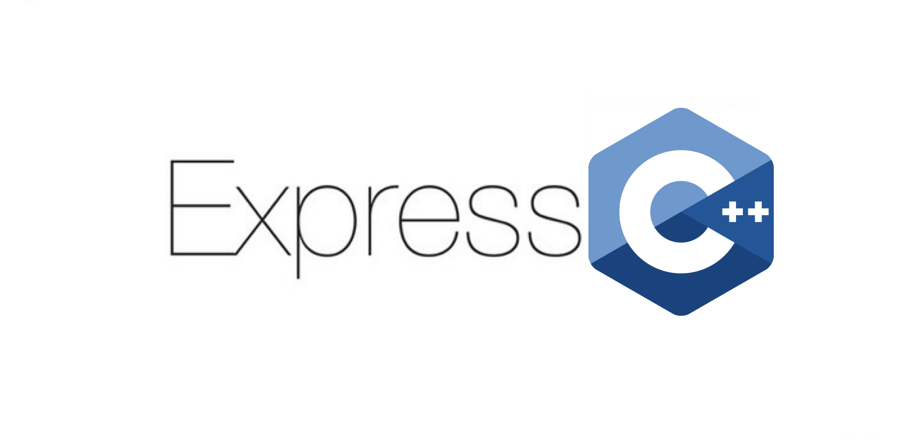

# ExpressCpp

Fast, unopinionated, minimalist web framework for C++
Perfect for building REST APIs



[](https://bintray.com/expresscpp/expresscpp/expresscpp%3Aexpresscpp/_latestVersion)
[](https://gitlab.com/expresscpp/expresscpp/commits/master)
[](https://gitlab.com/expresscpp/expresscpp/commits/)
[](https://img.shields.io/badge/quality-alpha-red)
[](https://opensource.org/licenses/MIT)
[](https://en.wikipedia.org/wiki/C%2B%2B17)

## Design goals

ExpressCpp aims to be for C++ the same as express for Node.JS including its ecosystem of middlewares and extensions.

Express and Node.JS:

```js
const express = require('express');
const app = express();
app.get('/', (req, res) => res.send('Hello World!'));
const port = 3000;
app.listen(port, () => console.log(`Example app listening on port ${port}!`));
```

ExpressCpp:

```cpp
#include "expresscpp/expresscpp.hpp"
auto expresscpp = std::make_shared<ExpressCpp>();
expresscpp->Get("/", [=](auto req, auto res) { res->Send("hello world!") });
constexpr uint16_t port = 3000u;
expresscpp.Listen(port, [](){
    std::cout << "Example app listening on port "<< port << std::endl;
}).Run();
```

## Using me

### conan

```bash
conan remote add expresscpp https://api.bintray.com/conan/expresscpp/expresscpp/
```

add this to you conan file:

```txt
expresscpp/0.8.0@expresscpp/testing
```

this to your cmake:

```cmake
find_package(expresscpp)
# ...
target_link_libraries(my_target PRIVATE expresscpp::expresscpp)
```

### vendoring as subdirectory

```cmake
add_subdirectory(thirdparty/expresscpp)
# ...
target_link_libraries(my_target PRIVATE expresscpp::expresscpp)
```

### installing and using find_package

```cmake
git clone https://gitlab.com/expresscpp/expresscpp.git
cd expresscpp
mkdir build
cd build 
cmake ..
make -j
sudo make install

find_package(expresscpp)
# ...
target_link_libraries(my_target PRIVATE expresscpp::expresscpp)
```

## Build instructions (e.g. ubuntu)

### Dependencies

- boost[asio, beast, uuid]
- nlohmann/json
- libfmt
- gtest (optional)

#### Conan

```bash
sudo apt install -y cmake gcc-9 g++-9 python3-pip

# conan for dependency management
sudo pip3 install conan --upgrade
conan remote add bincrafters "https://api.bintray.com/conan/bincrafters/public-conan"

mkdir -p build
cd build
cmake .. -DEXPRESSCPP_USE_CONAN_DEPENDENCIES=ON
cmake --build . -j
```

#### Debian

```bash
sudo apt install -y cmake gcc-9 g++-9

# get debian dependencies
sudo apt install -y libboost-all-dev nlohmann-json3-dev libfmt-dev libgtest-dev

mkdir -p build
cd build
cmake ..
cmake --build . -j
```

## Examples

| name                 | file                                                                         |
|----------------------|------------------------------------------------------------------------------|
| query params         | [./example/query_params.cpp](./example/query_params.cpp)                     |
| url params           | [./example/url_params.cpp](./example/url_params.cpp)                         |
| auth-like middleware | [./example/middleware_auth_like.cpp](./example/middleware_auth_like.cpp)     |
| log-like middleware  | [./example/middleware_logger_like.cpp](./example/middleware_logger_like.cpp) |
| error handler        | [./example/error_handler.cpp](./example/error_handler.cpp)                   |
| variadic middlewares | [./example/multiple_handlers.cpp](./example/multiple_handlers.cpp)           |
| subrouting           | [./example/router.cpp](./example/router.cpp)                                 |

## Official Middlewares

| name                       | file                                                     |
|----------------------------|----------------------------------------------------------|
| static file provider       | [./example/serve_static.cpp](./example/serve_static.cpp) |
| favicon provider(embedded) | [./example/favicon.cpp](./example/serve_favicon.cpp)     |

- expresscpp-logger -> TODO
- expresscpp-grpc-proxy -> TODO
- expresscpp-reverse-proxy -> TODO
- expresscpp-basic-auth -> TODO

## Similiar projects

| name                | repo                                         |
|---------------------|----------------------------------------------|
| BeastHttp           | https://github.com/0xdead4ead/BeastHttp/     |
| crow (unmaintained) | https://github.com/ipkn/crow                 |
| Simple-Web-Server   | https://gitlab.com/eidheim/Simple-Web-Server |
| restinio            | https://github.com/stiffstream/restinio      |
| served              | https://github.com/meltwater/served          |
