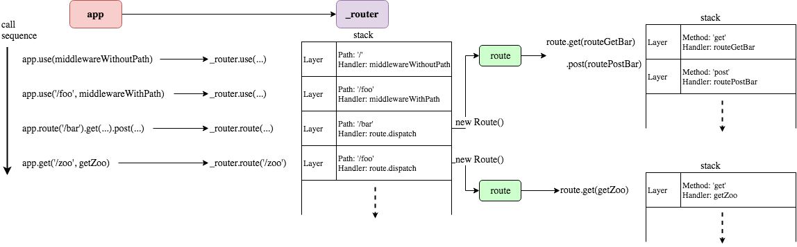
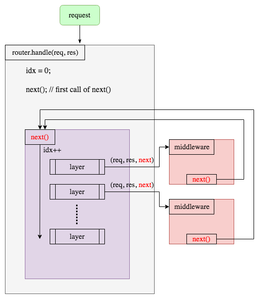

# Architecture Overview

<!-- to view those images: `sudo apt install -y graphviz default-jre` and install the recommended vscode extentions -->

## Layer Concept

source: https://blog.laputa.io/understanding-expressjs-d5ef4f4646c8

## Next chaining Concept

source: https://blog.laputa.io/understanding-expressjs-d5ef4f4646c8

